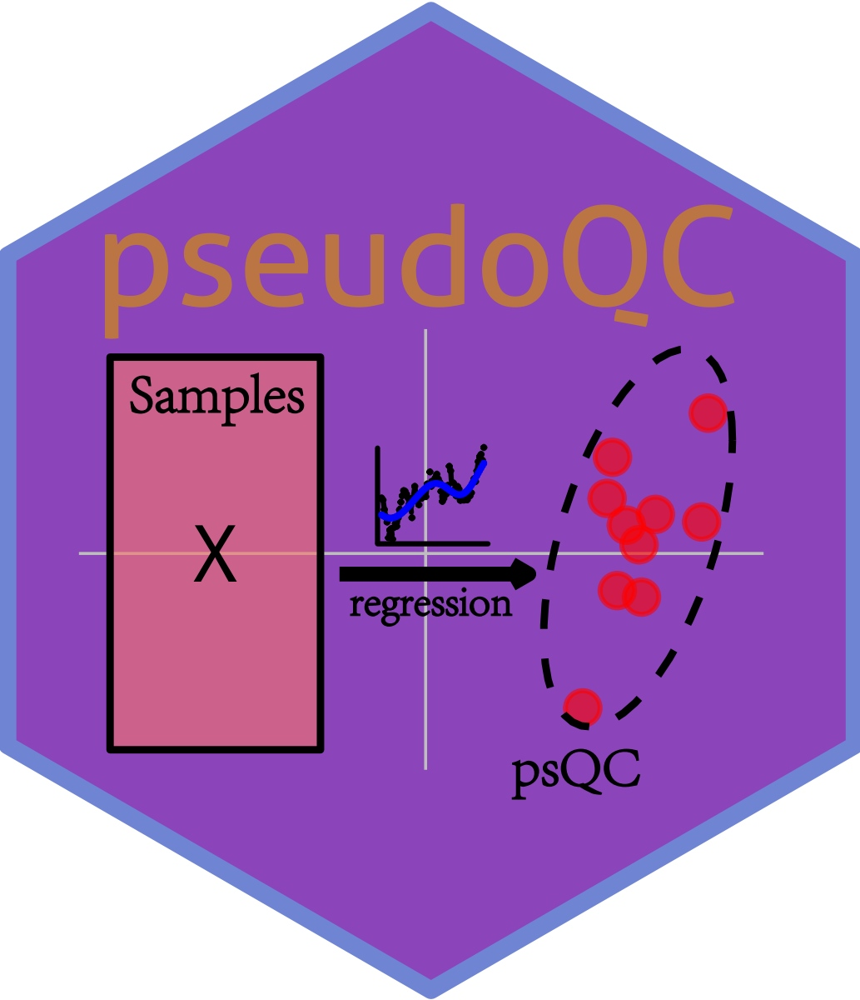
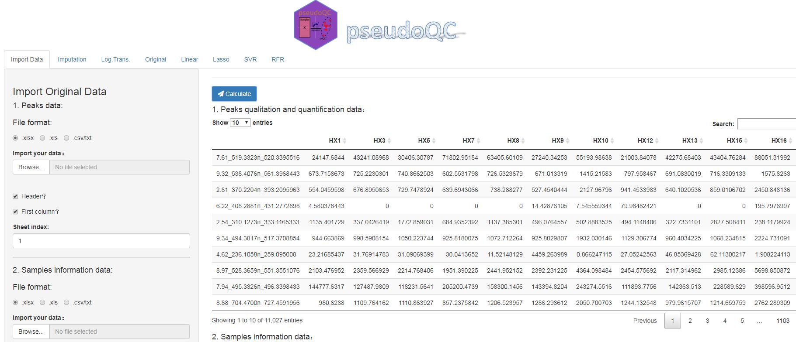

# pseudoQC
#### pseudoQC: A Regression-Based Simulation Software for Correction and Normalization of Complex Metabolomics and Proteomics Datasets

## Brief Description
** pseudoQC ** is a powerful and interactive web-based software to simulate QC sample data for actual metabolomics and proteomics datasets using four different machine learning–based regression methods. It is developed with [R](https://www.r-project.org/) and the software can also be found here: [https://www.omicsolution.org/wukong/pseudoQC/](https://www.omicsolution.org/wukong/pseudoQC/). Open this link and then you can start your own analysis:

## How to use
The detailed operation about ** pseudoQC ** can be found in [pseudoQC.Supplementary.pdf](https://github.com/qade544/pseudoQC/blob/master/pseudoQC.Supplementary.pdf) file.

## Contact
You could push an issue on this github. And optionally, please feel free to sent me an e-mail if you have any question or find a bug about this tool. Thank you^_^
Email: wssdandan2009@outlook.com
